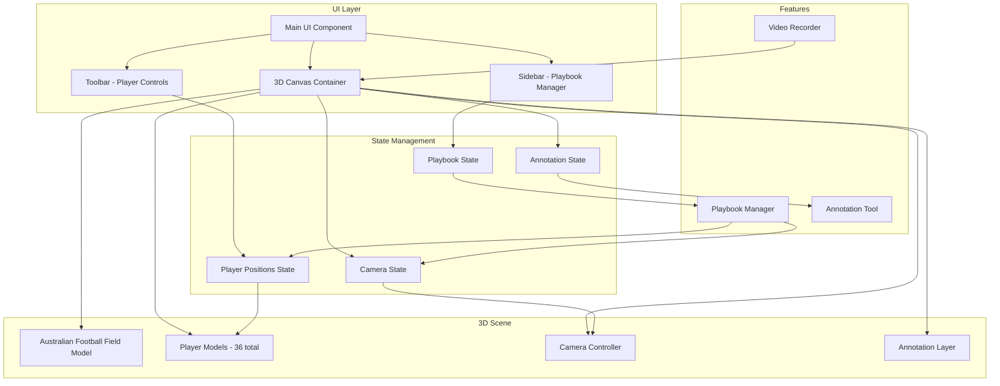

# Australian Football 3D Coaching Board Application

## Overview

A web-based 3D coaching board application that allows coaches to recreate game scenarios with full camera control, position 36 players (18 per team) on a realistic Australian Football field, create videos, save playbooks, and add annotations.

## Technology Stack

### Frontend Framework

- **React** with **TypeScript** - Modern UI framework with type safety
- **Three.js** or **Babylon.js** - 3D rendering engine (Three.js recommended for simplicity and community support)
- **React Three Fiber** - React renderer for Three.js (simplifies 3D scene management)
- **Drei** - Useful helpers for React Three Fiber (camera controls, helpers, etc.)

### State Management

- **Zustand** or **Redux Toolkit** - For application state (player positions, camera state, playbooks)
- **React Query** - For data fetching if backend is needed

### UI Components

- **Tailwind CSS** - Styling
- **Radix UI** or **shadcn/ui** - Accessible component primitives
- **Framer Motion** - Smooth animations for UI elements

### Video Export

- **MediaRecorder API** - Browser-based video recording
- **FFmpeg.wasm** - For video processing/encoding if needed
- **html2canvas** - For frame capture if needed

### Storage

- **IndexedDB** (via **Dexie.js**) - Client-side playbook storage
- **LocalStorage** - User preferences
- Optional: **Firebase** or **Supabase** - Cloud storage for sharing playbooks

## Architecture



## Core Components

### 1. 3D Scene Setup

- **Field Model**: Create or import realistic Australian Football field (oval shape, center square, goal posts)
- **Player Models**: 3D player models or simple representations (can start with colored spheres/capsules, upgrade to detailed models later)
- **Camera System**: Orbit controls for rotation, zoom, and pan
- **Lighting**: Realistic lighting setup (directional, ambient)

### 2. Player Management

- **Player Component**: Individual player representation with team colors
- **Player Controls**: Drag-and-drop positioning, rotation
- **Team Management**: Two teams (18 players each) with distinct colors
- **Player Selection**: Click to select and move players

### 3. Camera Controls

- **Orbit Controls**: Rotate around scene, zoom in/out
- **Focus Mode**: Click player to focus camera on them
- **Preset Views**: Top-down, sideline, end-to-end views
- **Smooth Transitions**: Animated camera movements

### 4. Video Recording

- **Recording State**: Start/stop recording
- **Frame Capture**: Capture canvas frames at consistent intervals
- **Video Encoding**: Combine frames into MP4 using MediaRecorder or FFmpeg.wasm
- **Export**: Download MP4 file

### 5. Playbook Management

- **Save Scenario**: Store current player positions, camera angle, annotations
- **Load Scenario**: Restore saved scenarios
- **Scenario List**: Display all saved playbooks
- **Metadata**: Name, description, date created

### 6. Annotation Tools

- **Drawing Layer**: Overlay 2D drawing on 3D scene
- **Tools**: Lines, arrows, shapes, text
- **Colors**: Multiple color options
- **Clear/Undo**: Annotation management

## File Structure

```
afl-coaching-board/
├── src/
│   ├── components/
│   │   ├── Scene/
│   │   │   ├── Field.tsx              # Field 3D model component
│   │   │   ├── Player.tsx              # Individual player component
│   │   │   ├── PlayerManager.tsx       # Manages all 36 players
│   │   │   ├── CameraController.tsx    # Camera controls
│   │   │   └── AnnotationLayer.tsx    # Annotation overlay
│   │   ├── UI/
│   │   │   ├── Toolbar.tsx             # Main toolbar
│   │   │   ├── PlayerPanel.tsx         # Player controls
│   │   │   ├── PlaybookPanel.tsx       # Playbook sidebar
│   │   │   └── VideoControls.tsx       # Video recording controls
│   │   └── Layout/
│   │       └── MainLayout.tsx          # App layout
│   ├── hooks/
│   │   ├── usePlayerControls.ts        # Player drag/drop logic
│   │   ├── useCameraControls.ts        # Camera control logic
│   │   ├── useVideoRecorder.ts         # Video recording hook
│   │   └── usePlaybook.ts              # Playbook save/load
│   ├── store/
│   │   ├── playerStore.ts              # Player positions state
│   │   ├── cameraStore.ts               # Camera state
│   │   ├── playbookStore.ts             # Playbook state
│   │   └── annotationStore.ts           # Annotation state
│   ├── models/
│   │   ├── FieldModel.ts                # Field geometry/data
│   │   └── PlayerModel.ts               # Player data structure
│   ├── utils/
│   │   ├── videoExport.ts               # Video export utilities
│   │   ├── playbookStorage.ts           # IndexedDB operations
│   │   └── fieldGeometry.ts             # Field measurements/geometry
│   ├── App.tsx
│   └── main.tsx
├── public/
│   ├── models/                          # 3D model files (if using external models)
│   └── assets/                          # Textures, images
├── package.json
└── vite.config.ts                       # Vite configuration
```

## Implementation Phases

### Phase 1: Foundation

1. Set up React + TypeScript + Vite project
2. Install Three.js, React Three Fiber, Drei
3. Create basic 3D scene with camera
4. Implement simple field representation (oval shape)

### Phase 2: Player System

1. Create player component (start with simple geometry)
2. Implement 36 players (18 per team)
3. Add drag-and-drop positioning
4. Team color differentiation

### Phase 3: Field & Camera

1. Create detailed Australian Football field model
2. Implement camera controls (orbit, zoom, pan)
3. Add preset camera views
4. Smooth camera transitions

### Phase 4: Core Features

1. Video recording functionality
2. MP4 export
3. Playbook save/load (IndexedDB)
4. Basic UI panels

### Phase 5: Annotations

1. Drawing layer overlay
2. Annotation tools (lines, arrows, shapes)
3. Color picker
4. Clear/undo functionality

### Phase 6: Polish

1. UI/UX improvements
2. Performance optimization
3. Error handling
4. Documentation

## Key Technical Considerations

### Australian Football Field Specifications

- Oval shape (not rectangular like soccer)
- Center square (50m x 50m)
- Goal posts at each end
- Field dimensions: ~150-185m length, ~120-155m width (varies by venue)
- Center circle radius: 3m

### Performance Optimization

- Use instanced rendering for players (if all similar)
- Level of Detail (LOD) for player models
- Frustum culling
- Efficient state updates

### Browser Compatibility

- MediaRecorder API support
- WebGL support
- IndexedDB support

## Dependencies (package.json)

```json
{
  "dependencies": {
    "react": "^18.2.0",
    "react-dom": "^18.2.0",
    "@react-three/fiber": "^8.15.0",
    "@react-three/drei": "^9.88.0",
    "three": "^0.158.0",
    "zustand": "^4.4.0",
    "dexie": "^3.2.4",
    "framer-motion": "^10.16.0",
    "tailwindcss": "^3.3.0"
  },
  "devDependencies": {
    "@types/react": "^18.2.0",
    "@types/three": "^0.158.0",
    "typescript": "^5.2.0",
    "vite": "^5.0.0"
  }
}
```

## Future Enhancements (Out of Scope)

- Player animations (running, kicking)
- Real-time collaboration
- Import/export playbooks as JSON
- Player statistics overlay
- Timeline-based animations
- Mobile app version